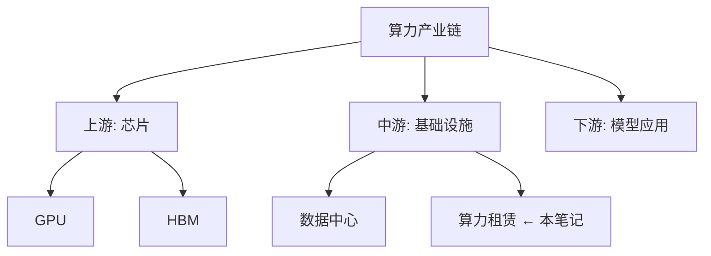

# 笔记模板 v2（含知识构建四维度）

---

## 一、笔记元数据

```yaml
title: ""
source: ""
date: ""
tags: []
domain: ""           # 所属知识域（如"算力产业链"）
framework_node: ""   # 在框架中的位置
status: 完成
```

## 二、笔记正文（原有）

### 视频信息
### 核心知识点
### 关键概念
### 实用建议/行动项
### 延伸学习

---

## 三、知识框架定位 【新增】

### 本笔记在框架中的位置


### 填补的知识盲区
- [x] 此前不了解的 XXX 概念 → 现已覆盖
- [ ] 仍待了解的相关概念

## 四、概念关联 【新增】

| 本笔记中的概念 | 关联到已有概念 | 关系类型 |
|:-------------|:-------------|:--------|
| XXX | YYY（来自 另一篇笔记） | 支撑/矛盾/互补 |

## 五、个人见解 【新增】

### 我的理解
...（用自己的话复述核心逻辑）

### 质疑/反思
...（哪里不同意、哪里觉得不够完整）

### 应用联想
...（这个知识可以怎么用、和什么联系起来）

## 六、学习路径更新 【新增】

### 本笔记启发的主动学习方向
- [ ] 方向1（P0/本周）
- [ ] 方向2（P1/本月）

### 知识盲区标记
- [ ] XXX（待后续视频/研报填补）
